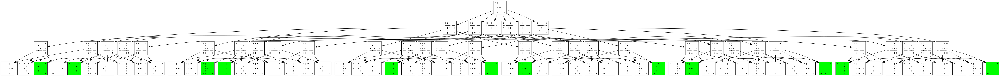
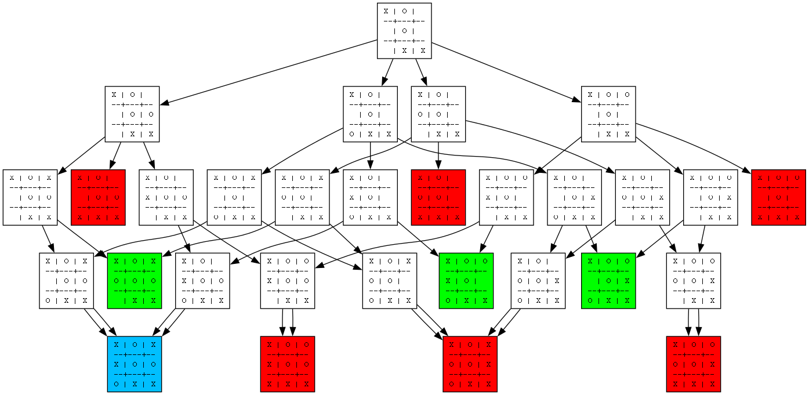
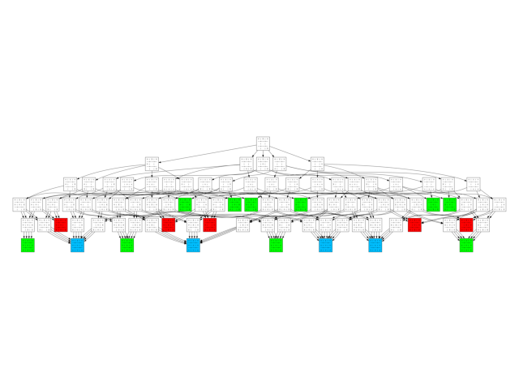
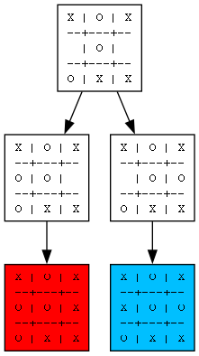

# TicTacToe mit Minimax und Visualisierung

Dieses Python-Projekt implementiert ein vollständiges Tic-Tac-Toe-Spiel mit einem intelligenten KI-Gegner, der mithilfe des Minimax-Algorithmus seine Züge berechnet. Zusätzlich werden die Entscheidungsprozesse der KI visuell in Baumstruktur dargestellt.

## Spielsystem
    - 2-Spieler-Modus gegen die KI (Spieler ist immer X, KI ist O)
    - Freie Wahl, wer beginnt (X oder O)
    - Eingabe per Konsole (Reihe Spalte [max_visuelle_tiefe])
    - Optional kann man bei jedem Zug die Visualisierungstiefe des Entscheidungsbaums angeben
    - Der Entscheidungsbaum wird nach jedem KI-Zug als PNG gespeichert und automatisch geöffnet
    - Farbige Darstellung im Baum:
        - Grün = KI gewinnt
        - Rot = Spieler gewinnt
        - Blau = Unentschieden
    - Jeder Knoten zeigt das Spielfeld in ASCII-Optik

## Minimax-Algorithmus
Der Minimax-Algorithmus wird oft verwendet, um Entscheidungen in Spielen zu treffen bei denen zwei Spieler gegeneinander antreten. Er ist ein Entscheidungsbaum-Algorithmus, der die möglichen Züge in einem Spielbaum analysiert, um den beisten Zug zu finden. Er handelt in der Annahme, dass der Spieler immer den für ihn besten Zug und der Gegner für den Spieler den schlechtesten Zug wählt. Er ist einfach zu implementieren und garantiert immer den besten Zug, solange der Gegner perfekt handelt. Jedoch ist der Algorithmus nicht fähig Spiele mit einer großen Anzahl an verschiedenen Zügen zu bezwingen, da die dafür benötigte Rechenleistung den Rahmen der Technologie sprengen würde. (Erklärung selber erstellt für Informatik-Abitur 2025)

## Programm-Preview

## Entscheidungsbäume für verschiedene Szenarien

